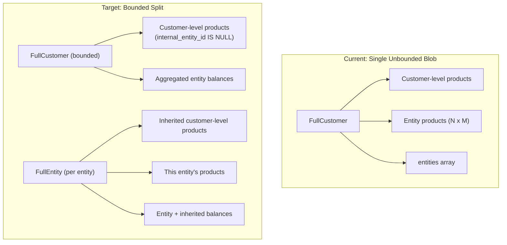

# Part A: V2 Full Customer Cache — Bounded Split + Rolling Migration

## Goal

Replace the single unbounded FullCustomer Redis blob with a bounded FullCustomer (customer-level) + per-entity FullEntity split, rolled out incrementally via percentage-based hashing.

## Architecture



Cache keys: `{orgId}:env:fullcustomer:2.0.0:customerId` and `{orgId}:env:fullentity:1.0.0:customerId:entityId`

**Entity inheritance**: FullEntity includes customer-level products because `filterCusProductsByEntity` passes through `internal_entity_id IS NULL` products. Deduction priority: entity's own balances first, then customer-level.

## Existing V2 work

- [server/src/internal/customers/repos/sql/getSubjectCoreQuery.ts](server/src/internal/customers/repos/sql/getSubjectCoreQuery.ts) — flat normalized query
- [server/src/internal/customers/repos/getFullCustomerV2/resultToFullCustomer.ts](server/src/internal/customers/repos/getFullCustomerV2/resultToFullCustomer.ts) — TS hydration
- [server/src/internal/customers/repos/getFullCustomerV2.ts](server/src/internal/customers/repos/getFullCustomerV2.ts) — repo function
- **Gap**: entity query doesn't include customer-level products (`internal_entity_id IS NULL`)

## Phases

### Phase 0 — Comparison tests

- Set up customer with entities, products, balances
- Call `getOrCreateCustomer` + `getEntity` endpoints
- Snapshot `subscriptions` array + `balances` object (minus `breakdown`)
- After V2 rollout, re-run and assert equivalence

### Phase 1 — FullEntity type + cache utilities

**Type** (`shared/models/cusModels/fullEntityModel.ts`):
```typescript
type FullEntity = {
  entity: Entity;
  customer: Customer;
  customer_products: FullCusProduct[]; // entity-scoped + inherited
  extra_customer_entitlements: FullCustomerEntitlement[];
};
```

**Cache utilities** (in `fullCustomerCacheUtils/`):
- `getCachedFullEntity.ts`, `setCachedFullEntity.ts`, `deleteCachedFullEntity.ts`, `getOrSetCachedFullEntity.ts`
- Path index at `{orgId}:env:fullentity:pathidx:customerId:entityId`
- Existing Lua scripts (deduction, etc.) are key-agnostic — reuse by passing entity cache key

**Config**: bump customer cache to `2.0.0`, add entity cache config

### Phase 2 — Wire V2 query into CusService

- `CusService.getFullV2` — flat query, customer-level only
- Update `getSubjectCoreQuery` — entity mode must also include `internal_entity_id IS NULL` products
- `CusService.getFullEntity` — hydrates to FullEntity
- `getOrSetCachedFullCustomer` uses V2 query on miss
- New `getOrSetCachedFullEntity` for entity flow

### Phase 3 — Endpoint migration

- `/check`: entity_id → FullEntity, else → bounded FullCustomer
- `/track`: same routing; Lua deduction targets entity or customer cache key
- `/customers.get`: bounded FullCustomer + aggregated entity data
- `/entities.get`: FullEntity directly (no more fetch-all-then-filter)
- **Dual-cache deduction**: inherited customer entitlements embedded in entity cache; sync writes from entity cache; customer cache refreshes on next miss

### Phase 4 — syncItemV3 compatibility

- Sync message includes `entityId` or cache key
- Entity-scoped cusEnts → read from entity cache
- Customer-level cusEnts → read from customer cache
- `sync_balances_v2` Postgres function unchanged
- During rollout: V1 fallback if cache version is 1.x

### Rolling migration (percentage-based)

Reuse from `origin/feat/custom-redis`:
- `getCustomerBucket(customerId)` — `Bun.hash(id) % 100`
- `resolveCustomerId` middleware
- `isCacheStale()` pattern

Rollout: deploy at 0% → ramp 5 → 10 → 25 → 50 → 75 → 100. Monitor Redis latency, Postgres load, API correctness at each step. Staleness detection invalidates old-format cache when a customer's routing flips.

### Future: product-level splitting (design consideration)

If customer-level products grow large (50+ add-ons), the bounded FullCustomer could be further split:
- Customer core: fields + product ID index (fixed-size)
- Product sub-docs: `{orgId}:env:fullcusproduct:1.0.0:customerId:cusProductId`
- Path index maps `cusEntId` → product cache key + sub-path
- Assembly via pipelined `JSON.GET` across product keys

**Not implementing now** — monitor p99 product count. But cache key format and path index design should not preclude this.

## Billing actions (NOT in scope)

Billing (attach, updateSubscription) needs ALL customer products across ALL entities for Stripe subscription merging. These skip the bounded cache and query Postgres directly. After billing, invalidate all customer + entity caches.

## Key files

**Create**: `fullEntityModel.ts`, `getCachedFullEntity.ts`, `setCachedFullEntity.ts`, `deleteCachedFullEntity.ts`, `getOrSetCachedFullEntity.ts`, test files

**Modify**: `CusService.ts`, `getSubjectCoreQuery.ts`, `fullCustomerCacheConfig.ts`, `getOrSetCachedFullCustomer.ts`, `handleCheck.ts`, `handleTrack.ts`, `handleGetOrCreateCustomerV2.ts`, `handleGetEntityV2.ts`, `syncItemV3.ts`
