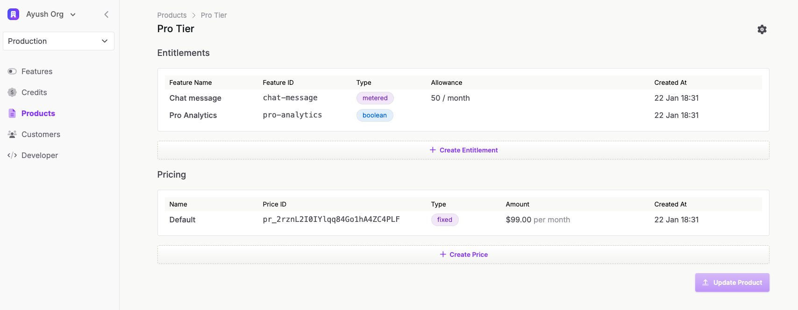
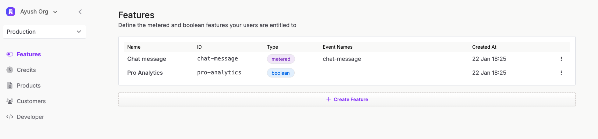

# Autumn


[](https://app.useautumn.com)
[](https://docs.useautumn.com)
[](https://deepwiki.com/useautumn/autumn)

[Autumn](https://useautumn.com) is an open-source layer between Stripe and your application, allowing you to create any pricing model and embed it with a couple lines of code. On Autumn you can build:
- Subscriptions
- Credit systems & top ups
- Usage-based models & overages
- Custom plans for large customers

All this without having to handle webhooks, upgrades/downgrades, cancellations or payment fails.

**Docs**: https://docs.useautumn.com

## How it works

### 1. Define your products and plans in Autumn

Create your products in Autumn's dashboard, and set the available features for each product. 



Features can be `boolean`, which are used to enable/disable features. Or, they can be `metered`, for tracking usage-based aspects of your product.



You define the level of granularity you want: whether that's 1 single boolean feature flag (eg: `pro-features`) to enable all your paid features, or splitting them each into their own feature. 

Once defined, you can check if a user has access to any of the defined features with a simple API call from your codebase.

### 2. Embed the products in your application
There are only 2 functions you need to call from your codebase:

1. `/entitled` - check if a user has access to a feature
2. `/events` - *(optional)* track the usage of metered features

```javascript
// 1. Check if a user has access to a feature
const response = await fetch('https://api.useautumn.com/v1/entitled', {
  method: "POST",
  headers: {Authorization: 'Bearer <token>', 'Content-Type': 'application/json'},
  body: JSON.stringify({
    "customer_id": "my_personal_id",
    "feature_id": "premium_msg"
  })
})

// 2. Check if user is allowed
let data = await response.json()
if (!data.allowed) {
  throw new Error(`feature not allowed`)
}

// 3. Send event if user accesses feature
await fetch('https://api.useautumn.com/v1/events', {
  method: "POST",
  headers: {Authorization: 'Bearer <token>', 'Content-Type': 'application/json'},
  body: JSON.stringify({
    "customer_id": "my_personal_id",
    "event_name": "premium_msg"
  })
})
```

No need to handle any customer logic. You can use your own customer IDs, and if the customer doesn't exist in Autumn, they'll be created automatically (and assigned any default plans).

### 3. Attach a product to a customer on purchase

Whenever a customer attempts to purchase a product, you can assign it to them using the `/attach` function. If the card is not on file, Autumn will return a Stripe checkout URL to collect payment. 

Otherwise, it will automatically handle any upgrade, downgrade or pro-ration logic.

```javascript
const response = await fetch('https://api.useautumn.com/v1/attach', {
  method: "POST",
  headers: {Authorization: 'Bearer <token>', 'Content-Type': 'application/json'},
  body: JSON.stringify({
    "customer_id": "my_personal_id",
    "product_id": "prod_2rwydCAcuUp913PqoZwOjpy4aDM"
  })
})

const data = await response.json()

if (data.checkout_url) {
  // Redirect user to checkout_url
}
```

## Congratulations!

You've embedded a full billing system into your application within a few minutes. You can make any pricing model changes you need, or handle custom plans without needing to alter your codebase.

Feel free to self-host Autumn, or use our hosted version at https://useautumn.com. And let us know any questions, thoughts or feedback at hey@useautumn.com.
