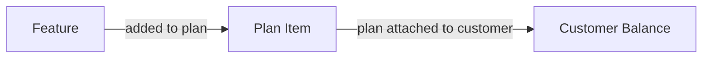

Balances determine what features a customer can use, and track how much they have used. 

Balances are created in two ways:

1. **Automatically from plans**: When a plan is attached to a customer, each feature in the plan becomes a balance for that customer.
2. **Standalone via API**: You can create balances directly using the API, independent of any plan. See [Managing Balances](/documentation/customers/managing-balances) for details.



## Core Fields

Each balance has the following key fields:

| Field | Description |
|-------|-------------|
| `included_usage` | The amount granted by the plan, or a purchased quantity |
| `balance` | The remaining amount available |
| `usage` | The amount that has been consumed |

When you retrieve a customer, their balances will be included in the response. 

<Tip>
For the complete balance schema including reset configuration, overage settings, and breakdown details, see the [Get Customer API reference](/api-reference/customers/get-customer).
</Tip>

<Expandable title="example customer response">
```json
{
  "balances": {
    "messages": {
      "granted_balance": 1000,
      "current_balance": 750,
      "usage": 250,
      "unlimited": false,
      "reset": {
        "interval": "month",
        "resets_at": 1745193600000
      }
    },
    "premium-support": {
      "unlimited": true
    }
  }
}
```
</Expandable>

## Feature Types and Balances

When you create a feature, you define its type. This affects how balances behave.

### Consumable Features

Features that are used up and can be replenished. Examples: credits, API requests, AI tokens.

Consumable features support **reset intervals** - the balance resets to the granted amount on a regular schedule.

Available reset intervals:
- `hour`, `day`, `week`, `month`, `quarter`, `semi_annual`, `year`
- `one_off` - the balance never resets (useful for one-time grants or top-ups)

### Non-Consumable Features

Features with persistent, continuous usage. Examples: seats, workspaces, storage.

Non-consumable features don't reset. Instead, they support **proration** when quantities change mid-billing cycle.

### Credit Systems

A [credit system](/documentation/modelling-pricing/credit-systems) lets multiple features draw from a single shared balance.

When you check or track usage, you use the underlying feature ID (e.g., `premium_message`), but the balance is deducted from the credit system.

When you track usage for a feature in a credit system, Autumn:
1. Looks up the credit cost for that feature that you defined
2. Multiplies the usage value by the credit cost
3. Deducts from the credit system balance

For example, if you have a credit system with a credit cost of 2 credits per API request, and a customer uses 10 API requests, Autumn will deduct 20 credits from the balance.


## Positive and Negative Balances

A balance can be positive or negative:

- **Positive balance**: Customer has unused allowance remaining
- **Negative balance**: Customer has used more than their allowance (only possible if [overage](/documentation/concepts/plan-items#priced-features) is enabled)

<Note>
Features can only have a negative balance if they have a usage-based price that allows overage. Otherwise, tracking stops when balance reaches 0.
</Note>

## Balance Stacking

A single feature can have balances from multiple sources - different plans, add-ons, or standalone grants. 

Autumn combines these into a single parent balance while tracking each source separately in a `breakdown` array, grouped by plan and interval.

> **Example** <br />
> A customer has a feature, `messages`, with the following balances:
> - Pro plan: 500 messages per month
> - Top-up add-on: 200 lifetime messages
>
> Their total available balance is 700 `messages`.

### The Breakdown Array

Each balance source is tracked separately in the `breakdown` array. This lets you see exactly where the balance came from and how much remains from each source.

```json expandable
{
  "balances": {
    "messages": {
      "included_usage": 700,
      "balance": 700,
      "usage": 0,
      "breakdown": [
        {
          "id": "ent_abc123",
          "product_id": "pro",
          "included_usage": 500,
          "balance": 500,
          "usage": 0,
          "interval": "month",
          "next_reset_at": 1745193600000
        },
        {
          "id": "ent_def456",
          "product_id": "top-up",
          "included_usage": 200,
          "balance": 200,
          "usage": 0,
          "interval": "one_off",
          "next_reset_at": null
        }
      ]
    }
  }
}
```

### Deduction Order

When usage is tracked, Autumn deducts from balances in a specific order based on their reset interval. **Shorter intervals are deducted first** by default.

The order is: `hour` (shortest) > `day` > `week` > `month` > `quarter` > `semi_annual` > `year` > `one_off` (lifetime - never resets).

This ensures that expiring balances are used before permanent ones.

<Note>
If you need the deduction order reversed (longest interval first), please [contact us](https://discord.gg/STqxY92zuS).
</Note>

> **Example** <br />
> Suppose a customer has two balances for messages: 500 monthly and 200 lifetime. They have a total of 700 messages. <br />
> - The customer uses 400 messages. The monthly balance (the shorter interval) is used up first, leaving 100 in monthly and 200 in lifetime (300 total). <br />
> - The customer uses another 200 messages. The remaining 100 monthly is depleted, and the next 100 is deducted from the lifetime balance. Now, monthly is 0, lifetime is 100 (100 total). <br />
> - On the next cycle, the monthly balance resets to 500, and the lifetime remains at 100, for a new total of 600. <br />
