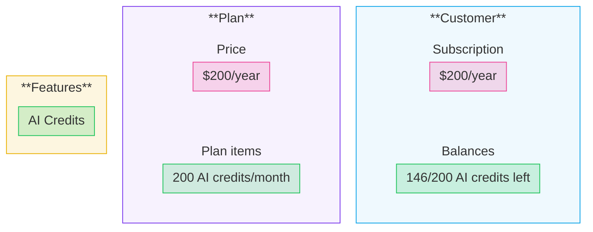

Autumn's data model has a clear pipeline: you define **features**, bundle them into **plans** with pricing, and when a plan is attached to a customer, it creates a **subscription** and provisions **balances** that you can check and track in real-time.

## Features

Features represent the parts of your product you want to control access to. There are three types: **boolean** (on/off flags like premium analytics), **consumable** (usage that resets, like API requests or credits), and **non-consumable** (persistent quantities like seats or storage).

Features are the atomic building blocks — everything else is built on top of them.

<Card title="Features" icon="puzzle-piece" href="/documentation/concepts/features">
  Learn about feature types and how to create them
</Card>

## Plans

Plans bundle features together with a base price. Each plan represents a distinct pricing tier or package you offer — free, pro, enterprise, or any add-on. You define which features are included, how they're priced, and any properties like trials or auto-enable.

<Card title="Plans" icon="layer-group" href="/documentation/concepts/plans">
  Learn about plan pricing, properties and groups
</Card>

## Plan Items

When you add a feature to a plan, it becomes a **plan item** with its own configuration. Included items grant a usage amount at no extra cost. Priced items add billing — either prepaid or usage-based — with options for billing units, tiers, and proration.

Plan items are where the "what" (features) meets the "how much" (pricing).

<Card title="Plan Items" icon="sliders" href="/documentation/concepts/plan-items">
  Configure grants, pricing and usage models
</Card>

## Subscriptions

When you attach a plan to a customer, Autumn creates a Stripe subscription under the hood and provisions balances for each feature in the plan. Subscriptions track status (active, trialing, past_due, etc.) and handle the payment lifecycle.

<Card title="Subscriptions" icon="arrows-repeat" href="/documentation/concepts/subscriptions">
  How Autumn manages Stripe subscriptions
</Card>

## Balances

Balances are the customer-facing result of everything above. Each plan item becomes a balance that tracks what the customer has been granted, what they've used, and what remains. Balances from multiple sources (plans, add-ons, top-ups) stack together, with shorter-interval balances consumed first.

Your app interacts with Autumn primarily through balances — calling `/check` to gate access and `/track` to record usage.

<Card title="Balances" icon="scale-balanced" href="/documentation/concepts/balances">
  Understand balance stacking, resets and deduction order
</Card>

## Runtime

Once your features, plans and pricing are configured, your app interacts with Autumn through a few core endpoints.

<Steps>
<Step title="Model your pricing in Autumn">
Model your pricing plans in the Autumn UI, or through a config file. Define your free, paid and any add-on pricing tiers.

You can link features to these plans and define their usage limits: both recurring (monthly, yearly), one-time top ups, rollovers, etc.
</Step>
<Step title="Handle payments">
The [attach](/api-reference/billing/attach) endpoint subscribes a customer to a plan or purchases a one-time product. It handles new subscriptions, upgrades, downgrades and add-ons — creating the Stripe subscription and provisioning balances automatically.

Once paid, Autumn grants access to the features on their plan.
</Step>
<Step title="Check permissions and limits">
When a customer tries to do something (eg, use a credit), [check](/api-reference/core/check) in real-time whether they're allowed to based on their active plans and remaining balance.

Set `send_event` to atomically deduct usage while checking.
</Step>
<Step title="Track usage">
If the customer is allowed access, let them use the feature. Afterwards, [track](/api-reference/core/track) the usage to update their balance, or bill them for any usage-pricing.
</Step>
</Steps>

Autumn also provides endpoints to [get customer billing data](/api-reference/customers/getOrCreateCustomer) (subscriptions, balances, invoices, payment methods), open Stripe billing portal, display usage analytics, handle org billing, and more.
