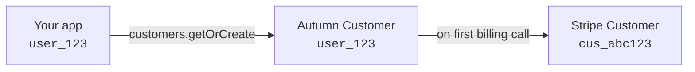

Autumn uses Stripe to create subscriptions and charge customers. You define plans, features and pricing in Autumn, and Stripe objects (customers, products, prices, subscriptions, invoices) are created automatically as they're needed.

You never need to manually create or interact with these objects in Stripe. Autumn handles the full lifecycle, and owns the customer state.

## Autumn and Stripe responsibilities

Autumn is the source of truth for a customer's state and what they can do. Stripe handles subscriptions and payments.

| Feature | Managed by | Details |
|---|---|---|
| Pricing and features | **Autumn** | Define and update in Autumn dashboard or API |
| Balances & credit ledgers | **Autumn** | Tracked in real-time via `/check` and `/track` |
| Usage metering | **Autumn** | Tracks usage internally, posts totals to Stripe at cycle end (if configured) |
| Feature gating | **Autumn** | `/check` evaluates access from Autumn's balances |
| Subscriptions and payments | **Stripe** | Autumn creates Stripe subscriptions and charges customers |
| Invoices & receipts | **Stripe** | Generated and delivered by Stripe |
| Checkout pages | **Stripe** | Hosted by Stripe for new payment methods |
| Refunds & disputes | **Stripe** | Issue refunds directly in Stripe dashboard |

<Warning>
Autumn does not read from Stripe. If you rename a product, change a price or cancel a subscription directly in the Stripe dashboard, Autumn won't pick up those changes. Always make changes through the Autumn dashboard or API.
</Warning>

## Connecting Stripe

There are three ways to connect your Stripe account to Autumn:

| Method | When to use |
|---|---|
| **Default sandbox** | Automatic — every new Autumn org gets a Stripe Connect sandbox account with no setup needed |
| **OAuth** | Recommended for production. Connect via the deploy dialog in the Autumn dashboard |
| **Secret key** | Paste your Stripe secret key directly. Autumn creates a webhook endpoint automatically |

When you connect a Stripe account, Autumn automatically syncs all your existing plans into the new account as Stripe products and prices. This means you can set up your pricing model in sandbox, then connect your live Stripe account and everything carries over.

<Note>
When disconnecting and reconnecting a different Stripe account, existing Stripe IDs on your plans become invalid. Autumn will recreate the products and prices in the new account when you `attach` it, but old customers and subscriptions will no longer be linked.
</Note>

## Currency

Currency is set at the organization level and defaults to `usd`. You can change it when connecting Stripe or from the developer settings page.

All new Stripe prices are created in your configured currency. Changing the currency does not migrate existing subscriptions — those remain in the original currency. New prices and subscriptions going forward will use the updated currency.

## How customers map

When you create a customer in Autumn, you pass your own user ID (from your auth system, database, or any unique identifier) as the `customer_id`. This is the only ID you need — there's no separate "auth ID" concept.

By default, a Stripe customer is **not** created when you create an Autumn customer. The Stripe customer is created lazily — the first time a billing operation needs one (attaching a plan, opening the billing portal, setting up a payment method, etc.).

You can change this behavior:

- Pass `createInStripe: true` to create the Stripe customer immediately when the Autumn customer is created
- Pass `stripeId: "cus_abc123"` to link an existing Stripe customer instead of creating a new one

See [Creating Customers](/documentation/customers/creating-customers#stripe-integration) for details.

Once linked, the mapping is bidirectional:
- **Autumn → Stripe**: the Stripe customer ID is stored on the Autumn customer
- **Stripe → Autumn**: the Autumn customer ID is stored in the Stripe customer's `metadata`

## How products and prices map

Autumn creates Stripe objects lazily. The table below shows what maps to what:

| Autumn object | Stripe object | Created when |
|---|---|---|
| Plan | Product | Plan is created or updated in Autumn |
| Fixed price (on a plan) | Price | Plan is created or updated |
| Usage-based price (on a plan) | Separate Product + Price per feature | Plan is created or updated |
| Customer | Customer | First billing call (or immediately with `createInStripe`) |
| Subscription | Subscription | Plan is attached to a customer |

### Fixed prices

Each fixed price on a plan maps 1:1 to a Stripe price, attached to the plan's Stripe product.

### Usage-based prices

Usage-based prices are more complex. For each priced feature, Autumn creates a **separate Stripe product** (named `"Plan Name - Feature Name"`) with its own Stripe price. Depending on the billing model, Autumn may also create:

- An empty placeholder price to anchor the subscription
- A billing meter for in-arrear usage reporting
- A prepaid price for upfront usage billing

These are all managed automatically — you don't need to configure them.

### Renaming in Stripe

You can rename products and update their descriptions directly in the Stripe dashboard for display purposes (e.g., on invoices or the customer portal). Autumn won't overwrite these cosmetic changes.

<Note>
Renaming in Stripe is purely cosmetic. The plan's ID and configuration are still managed in Autumn. For structural changes (prices, features, billing model), always use Autumn.
</Note>

## Webhooks

Autumn automatically creates and manages webhook endpoints when you connect Stripe. You don't need to configure these manually.

Autumn listens for key Stripe events to keep state in sync:

| Event | What Autumn does |
|---|---|
| `checkout.session.completed` | Finalizes the plan attachment and provisions balances |
| `invoice.paid` | Records payment, triggers balance provisioning for deferred plans |
| `invoice.created` | Captures usage line items for arrear billing on renewal |
| `customer.subscription.updated` | Syncs subscription status (active, past_due, canceled, etc.) |
| `customer.subscription.deleted` | Expires the plan and activates default plans if configured |

## Direct vs deferred execution

When you call `billing.attach`, Autumn takes one of two paths depending on whether the customer can be charged immediately:

**Direct (immediate):** The customer already has a payment method. Autumn creates the Stripe subscription, charges the customer, and provisions balances — all in a single API call.

**Deferred (checkout):** The customer doesn't have a payment method, or the payment requires additional action (like 3DS). Autumn creates a Stripe Checkout Session (or returns a `required_action`), stores the pending billing plan, and completes everything when the webhook confirms payment.

See [Payment Flow](/documentation/customers/payment-flow) for the full breakdown of redirect modes and checkout behavior.

## What to do in Stripe directly

While Autumn manages most of the Stripe lifecycle, there are a few things you should handle in Stripe:

| Task | Where |
|---|---|
| Issue refunds | Stripe dashboard |
| Rename products for invoice display | Stripe dashboard |
| View payment logs and disputes | Stripe dashboard |
| Advanced subscription alterations (eg cycle anchors) | Stripe dashboard |
| Everything else (plans, pricing, subscriptions, customers) | **Autumn** |
