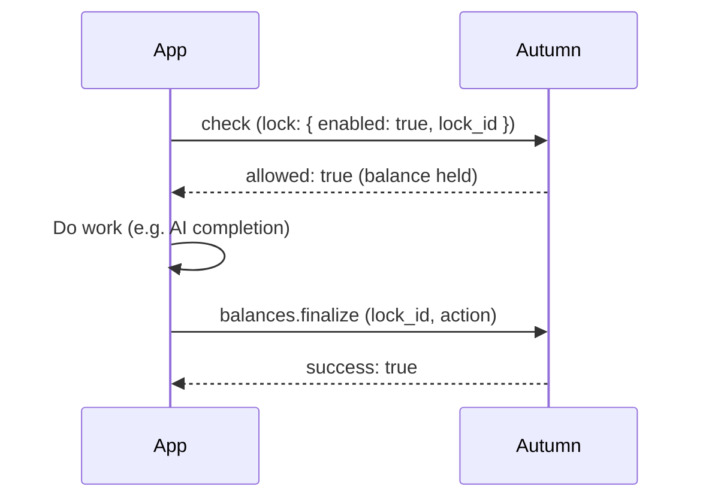

For operations where you don't know the final cost upfront — like AI completions, batch processing, or long-running jobs — you can **reserve** balance before the work starts, then **finalize** the reservation when it's done.

This is a three-step flow:

1. **Check with lock** — atomically check access and hold balance
2. **Do work** — run your operation
3. **Finalize** — confirm the deduction, adjust it, or release the hold



## Step 1: Check with lock

Pass the `lock` parameter to the check endpoint. This atomically checks if the customer has enough balance and reserves it in a single call.

<CodeGroup>

```typescript TypeScript
const response = await autumn.check({
  customerId: "user_123",
  featureId: "ai-tokens",
  requiredBalance: 1000,
  sendEvent: true,
  lock: {
    enabled: true,
    lockId: "completion_abc123",
    expiresAt: Date.now() + 5 * 60 * 1000, // 5 minutes
  },
});

if (!response.allowed) {
  // Customer doesn't have enough balance
}

// Balance is now held — proceed with the operation
```

```python Python
response = await autumn.check(
    customer_id="user_123",
    feature_id="ai-tokens",
    required_balance=1000,
    send_event=True,
    lock={
        "enabled": True,
        "lock_id": "completion_abc123",
        "expires_at": int(time.time() * 1000) + 5 * 60 * 1000,
    },
)

if not response.allowed:
    # Customer doesn't have enough balance
    pass

# Balance is now held — proceed with the operation
```

```bash cURL
curl -X POST "https://api.useautumn.com/v1/check" \
  -H "Authorization: Bearer am_sk_..." \
  -H "Content-Type: application/json" \
  -d '{
    "customer_id": "user_123",
    "feature_id": "ai-tokens",
    "required_balance": 1000,
    "send_event": true,
    "lock": {
      "enabled": true,
      "lock_id": "completion_abc123",
      "expires_at": 1735689600000
    }
  }'
```

</CodeGroup>

### Lock parameters

| Parameter | Type | Description |
|---|---|---|
| `enabled` | `boolean` | Must be `true` to enable locking |
| `lock_id` | `string` | A unique identifier for this lock. You'll use this to finalize later. If omitted, Autumn generates one. |
| `expires_at` | `number` | Unix timestamp (ms) when the lock auto-expires and releases the held balance. Max 24 hours from now. |

<Warning>
Always set an `expires_at` to prevent balance from being held indefinitely if your finalize call fails. If a lock expires, the held balance is automatically released back to the customer.
</Warning>

## Step 2: Do your work

Run whatever operation you reserved balance for. The held balance is guaranteed to be available — no other concurrent request can consume it.

## Step 3: Finalize the lock

When the operation completes, call `balances.finalize` to resolve the held balance.

### Confirm the full amount

If the operation used exactly the amount you reserved, confirm the lock:

<CodeGroup>

```typescript TypeScript
await autumn.balances.finalize({
  lockId: "completion_abc123",
  action: "confirm",
});
```

```python Python
await autumn.balances.finalize(
    lock_id="completion_abc123",
    action="confirm",
)
```

```bash cURL
curl -X POST "https://api.useautumn.com/v1/balances.finalize" \
  -H "Authorization: Bearer am_sk_..." \
  -H "Content-Type: application/json" \
  -d '{
    "lock_id": "completion_abc123",
    "action": "confirm"
  }'
```

</CodeGroup>

### Release the hold

If the operation failed or was canceled, release the lock to return the held balance:

<CodeGroup>

```typescript TypeScript
await autumn.balances.finalize({
  lockId: "completion_abc123",
  action: "release",
});
```

```python Python
await autumn.balances.finalize(
    lock_id="completion_abc123",
    action="release",
)
```

```bash cURL
curl -X POST "https://api.useautumn.com/v1/balances.finalize" \
  -H "Authorization: Bearer am_sk_..." \
  -H "Content-Type: application/json" \
  -d '{
    "lock_id": "completion_abc123",
    "action": "release"
  }'
```

</CodeGroup>

### Adjust the final amount

If the actual usage differs from the reserved amount (common with AI tokens), pass `overrideValue` to adjust:

<CodeGroup>

```typescript TypeScript
// Reserved 1000 tokens, but only used 743
await autumn.balances.finalize({
  lockId: "completion_abc123",
  action: "confirm",
  overrideValue: 743,
});
```

```python Python
# Reserved 1000 tokens, but only used 743
await autumn.balances.finalize(
    lock_id="completion_abc123",
    action="confirm",
    override_value=743,
)
```

```bash cURL
curl -X POST "https://api.useautumn.com/v1/balances.finalize" \
  -H "Authorization: Bearer am_sk_..." \
  -H "Content-Type: application/json" \
  -d '{
    "lock_id": "completion_abc123",
    "action": "confirm",
    "override_value": 743
  }'
```

</CodeGroup>

Autumn will reconcile the difference — returning the unused 257 tokens back to the customer's balance.

## Use cases

### AI completions

Reserve a token budget before starting generation, then finalize with the actual token count:

```typescript
const lockId = `completion_${generateId()}`;

const { allowed } = await autumn.check({
  customerId: "user_123",
  featureId: "ai-tokens",
  requiredBalance: 4000, // max_tokens
  sendEvent: true,
  lock: {
    enabled: true,
    lockId,
    expiresAt: Date.now() + 60_000,
  },
});

if (!allowed) return showUpgradePrompt();

const completion = await openai.chat.completions.create({
  model: "gpt-4",
  max_tokens: 4000,
  messages: [{ role: "user", content: prompt }],
});

await autumn.balances.finalize({
  lockId,
  action: "confirm",
  overrideValue: completion.usage.total_tokens,
});
```

### Long-running jobs

Reserve credits before queuing a job, release if the job fails:

```typescript
const lockId = `job_${jobId}`;

const { allowed } = await autumn.check({
  customerId: "user_123",
  featureId: "compute-credits",
  requiredBalance: 10,
  sendEvent: true,
  lock: {
    enabled: true,
    lockId,
    expiresAt: Date.now() + 30 * 60_000, // 30 min timeout
  },
});

if (!allowed) throw new Error("Insufficient credits");

try {
  await runJob(jobId);
  await autumn.balances.finalize({ lockId, action: "confirm" });
} catch (error) {
  await autumn.balances.finalize({ lockId, action: "release" });
  throw error;
}
```

## Compared to check + track

For simple operations where you know the cost upfront and the operation is fast, [check with `sendEvent`](/documentation/customers/check#checking-and-reserving-usage) is simpler — it deducts immediately in one call.

Use reservations when:

- The final usage amount is unknown at check time (e.g., AI token counts)
- The operation can fail after balance is deducted
- The operation takes significant time and you don't want another request to consume the same balance
