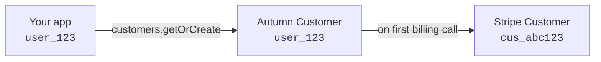

Customers represent the entities — usually users or organizations — of your application that can use and pay for your products.

For each customer, Autumn will:

- Keep record of the products they've purchased
- Track the features they've used and have access to
- Bill them through Stripe for the prices you've set

## Creating a customer via API

Use the `customers.getOrCreate` method to create a customer. This is idempotent — it creates the customer if they don't exist, or returns the existing one if they do.

<CodeGroup>

```typescript TypeScript
import { Autumn } from "autumn-js";

const autumn = new Autumn({ secretKey: "am_sk_test_1234" });

const customer = await autumn.customers.getOrCreate({
  customerId: "user_123",
  name: "John Doe",
  email: "john@example.com",
});
```

```python Python
from autumn_sdk import Autumn

autumn = Autumn("am_sk_test_1234")

customer = await autumn.customers.get_or_create(
    customer_id="user_123",
    name="John Doe",
    email="john@example.com",
)
```

```bash cURL
curl -X POST "https://api.useautumn.com/v1/customers" \
  -H "Authorization: Bearer am_sk_test_1234" \
  -H "Content-Type: application/json" \
  -d '{
    "customer_id": "user_123",
    "name": "John Doe",
    "email": "john@example.com"
  }'
```

</CodeGroup>

Only the `customerId` field is required — this should be your unique identifier for the customer that you'll use in all future API calls.

<Tip>
A common pattern is to call `customers.getOrCreate` on every login or signup in your application, so Autumn always has the latest customer information.
</Tip>

<Warning>
Customers must be created before calling the [`check`](/documentation/customers/check) or [`track`](/documentation/customers/tracking-usage) endpoints. If you call these endpoints with a `customer_id` that doesn't exist, the API will return a `customer_not_found` error. Make sure to call `customers.getOrCreate` during signup or login before checking access or tracking usage.
</Warning>

## Pre-creating customers via the dashboard

You can create a customer in the Autumn dashboard before they've ever interacted with your application. This is useful for enterprise or sales-led deals where you want to provision access before the customer signs up.

1. Navigate to the [Customers page](https://app.useautumn.com/customers)
2. Click "Create Customer"
3. Fill in the customer's details (name, email). **Leave the `id` field blank** — it will be assigned when the customer first logs in.
4. Click "Create Customer"

Once the customer is created, you can enable products and configure their features from the customer details page. When the customer eventually signs up in your application, Autumn will match them by email and link the pre-created customer record.

<Warning>
The email you provide must match the email the customer will use to sign up or log in. You can update the email from the customer details page if needed.
</Warning>

<Info>
**Example: Enterprise onboarding**

You've closed an enterprise deal with Acme Corp. Before their team starts using your product:

1. Create a customer in the dashboard with the billing contact's email
2. Enable a custom Enterprise plan with negotiated pricing
3. When the Acme team signs up, Autumn matches the email and they immediately have their plan active — no checkout needed
</Info>

## Customer properties

#### Customer ID

Your unique identifier for the customer. This is the only required field. It could be:

- Your database ID for the user
- Their email address
- Any other unique identifier in your system

#### Name and Email

Optional fields that help identify the customer in the Autumn dashboard and on Stripe invoices.

## Stripe integration

By default, Autumn does **not** create a Stripe customer when you create an Autumn customer. A Stripe customer is created lazily — only when the first billing operation needs one (like `billing.attach`, `billing.openCustomerPortal`, or `billing.setupPayment`).



You can change this behavior:

#### Create in Stripe immediately

Pass `createInStripe: true` to create the Stripe customer at the same time as the Autumn customer. This is useful if you need the Stripe customer ID upfront (e.g., for your own Stripe integration).

<CodeGroup>

```typescript TypeScript
await autumn.customers.getOrCreate({
  customerId: "user_123",
  name: "John Doe",
  email: "john@example.com",
  createInStripe: true,
});
```

```python Python
await autumn.customers.get_or_create(
    customer_id="user_123",
    name="John Doe",
    email="john@example.com",
    create_in_stripe=True,
)
```

```bash cURL
curl -X POST "https://api.useautumn.com/v1/customers" \
  -H "Authorization: Bearer am_sk_test_1234" \
  -H "Content-Type: application/json" \
  -d '{
    "customer_id": "user_123",
    "name": "John Doe",
    "email": "john@example.com",
    "create_in_stripe": true
  }'
```

</CodeGroup>

#### Link to an existing Stripe customer

If you already have a Stripe customer (e.g., you're migrating to Autumn), pass `stripeId` to link it instead of creating a new one:

<CodeGroup>

```typescript TypeScript
await autumn.customers.getOrCreate({
  customerId: "user_123",
  stripeId: "cus_abc123",
});
```

```python Python
await autumn.customers.get_or_create(
    customer_id="user_123",
    stripe_id="cus_abc123",
)
```

```bash cURL
curl -X POST "https://api.useautumn.com/v1/customers" \
  -H "Authorization: Bearer am_sk_test_1234" \
  -H "Content-Type: application/json" \
  -d '{
    "customer_id": "user_123",
    "stripe_id": "cus_abc123"
  }'
```

</CodeGroup>

Once linked, the mapping is bidirectional — the Stripe customer ID is stored on the Autumn customer, and the Autumn customer ID is stored in the Stripe customer's metadata.

<Note>
For more details on how Autumn and Stripe work together, see [Stripe Sync](/documentation/concepts/stripe).
</Note>
