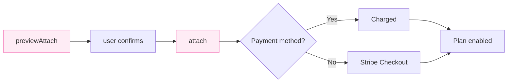

## Using hosted pages

By default, `billing.attach` returns a `paymentUrl` — just redirect the customer and Autumn handles payment collection, confirmation, and activation.

<CodeGroup>

```typescript TypeScript
const response = await autumn.billing.attach({
  customerId: "user_123",
  planId: "pro",
});

redirect(response.paymentUrl);
```

```tsx React
import { useCustomer } from "autumn-js/react";

const { attach } = useCustomer();

await attach({ planId: "pro" });
```

```python Python
response = await autumn.billing.attach(
    customer_id="user_123",
    plan_id="pro",
)
# Redirect to response.payment_url
```

```bash cURL
curl -X POST 'https://api.useautumn.com/v1/billing.attach' \
  -H 'Authorization: Bearer am_sk_...' \
  -H 'Content-Type: application/json' \
  -d '{
    "customer_id": "user_123",
    "plan_id": "pro"
  }'
```

</CodeGroup>

New customers without a payment method are sent to **Stripe Checkout**. Existing customers are sent to **Autumn Checkout** to review and confirm. After checkout, the customer is redirected to your `successUrl` (or the default URL in your Autumn dashboard).

## Building your own checkout

For full control over the checkout experience, use `redirectMode: "if_required"`. This charges the saved payment method directly instead of redirecting — the customer is only sent to Stripe Checkout if they don't have a payment method yet.



### Step 1: Preview the charge

Call `billing.previewAttach` to get line items, totals, and proration details to display in your UI.

<CodeGroup>

```typescript TypeScript
const preview = await autumn.billing.previewAttach({
  customerId: "user_123",
  planId: "pro",
});

// preview.lineItems  — array of charges and credits
// preview.total      — net amount in cents
// preview.currency   — e.g. "usd"
```

```tsx React
import { useCustomer } from "autumn-js/react";

const { previewAttach } = useCustomer();

const preview = await previewAttach({ planId: "pro" });
```

```python Python
preview = await autumn.billing.preview_attach(
    customer_id="user_123",
    plan_id="pro",
)
```

```bash cURL
curl -X POST 'https://api.useautumn.com/v1/billing.preview_attach' \
  -H 'Authorization: Bearer am_sk_...' \
  -H 'Content-Type: application/json' \
  -d '{
    "customer_id": "user_123",
    "plan_id": "pro"
  }'
```

</CodeGroup>

<Expandable title="Example response">
```json
{
  "customerId": "user_123",
  "lineItems": [
    {
      "title": "Pro Plan",
      "description": "Monthly subscription",
      "amount": 20
    },
    {
      "title": "Credit for Free Plan",
      "description": "Unused time on current plan",
      "amount": -5
    }
  ],
  "total": 15,
  "currency": "usd",
  "nextCycle": {
    "startsAt": 1735689600000,
    "total": 20
  }
}
```
</Expandable>

### Step 2: Confirm and charge

Once the customer confirms, call `billing.attach` with `redirectMode: "if_required"`.

<CodeGroup>

```typescript TypeScript
const response = await autumn.billing.attach({
  customerId: "user_123",
  planId: "pro",
  redirectMode: "if_required",
});

if (response.paymentUrl) {
  redirect(response.paymentUrl);
} else {
  showSuccess();
}
```

```tsx React
import { useCustomer } from "autumn-js/react";

const { attach } = useCustomer();

const response = await attach({
  planId: "pro",
  redirectMode: "if_required",
});
```

```python Python
response = await autumn.billing.attach(
    customer_id="user_123",
    plan_id="pro",
    redirect_mode="if_required",
)

if response.payment_url:
    redirect(response.payment_url)
else:
    show_success()
```

```bash cURL
curl -X POST 'https://api.useautumn.com/v1/billing.attach' \
  -H 'Authorization: Bearer am_sk_...' \
  -H 'Content-Type: application/json' \
  -d '{
    "customer_id": "user_123",
    "plan_id": "pro",
    "redirect_mode": "if_required"
  }'
```

</CodeGroup>

## Handling the response

The `billing.attach` response has two key fields:

**`payment_url`** — a URL the customer should be redirected to, or `null` if no redirect is needed.

**`required_action`** — present when payment couldn't be processed automatically. See [Edge Cases](/documentation/customers/billing/edge-cases) for details on handling 3DS, payment failures, and retries.
