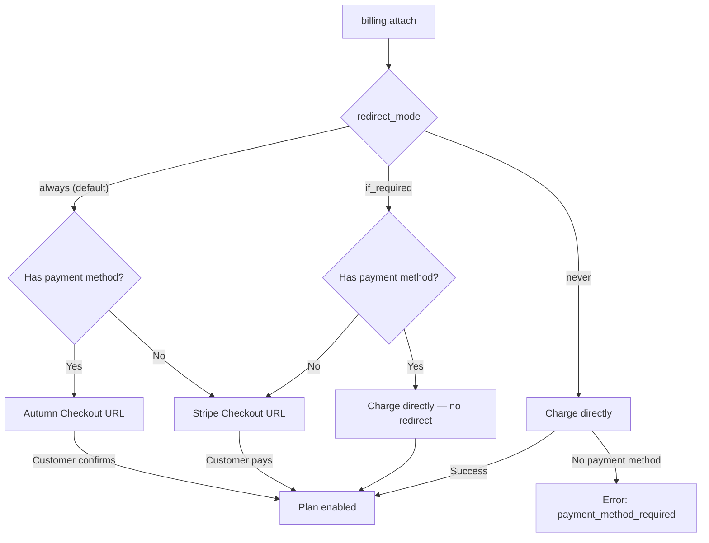

When you call `billing.attach`, Autumn handles payment collection through one of two paths depending on the `redirect_mode` you choose:

- **Hosted pages** — redirect the customer to a checkout page (Stripe or Autumn) to review and pay
- **Custom checkout** — show pricing in your own UI, then charge the customer's saved payment method directly



## `redirect_mode`

The `redirect_mode` parameter controls when `billing.attach` returns a `paymentUrl` instead of charging directly.

| Mode | Behavior | Best for |
|---|---|---|
| `"always"` **(default)** | Always returns a `paymentUrl`. New customers go to Stripe Checkout, existing customers go to Autumn Checkout for confirmation. | Getting started quickly — just redirect and you're done |
| `"if_required"` | Only returns a `paymentUrl` when the customer has no payment method. Otherwise charges directly. | Building your own checkout UI |
| `"never"` | Never returns a `paymentUrl`. Attempts to charge the saved payment method directly. Fails if none exists. | Backend-only flows where you've already collected payment |

## Using hosted pages

The simplest approach: call `billing.attach` and redirect the customer to the returned `paymentUrl`. Autumn handles the rest.

<CodeGroup>

```typescript TypeScript
const response = await autumn.billing.attach({
  customerId: "user_123",
  planId: "pro",
});

redirect(response.paymentUrl);
```

```tsx React
import { useCustomer } from "autumn-js/react";

const { attach } = useCustomer();

// Automatically redirects the customer
await attach({ planId: "pro" });
```

```python Python
response = await autumn.billing.attach(
    customer_id="user_123",
    plan_id="pro",
)
# Redirect to response.payment_url
```

```bash cURL
curl -X POST 'https://api.useautumn.com/v1/billing.attach' \
  -H 'Authorization: Bearer am_sk_...' \
  -H 'Content-Type: application/json' \
  -d '{
    "customer_id": "user_123",
    "plan_id": "pro"
  }'
```

</CodeGroup>

Where the customer lands depends on their situation:

| Scenario | Checkout type | What happens |
|---|---|---|
| New subscription, no payment method | **Stripe Checkout** | Customer enters card details and pays |
| New subscription, has payment method | **Autumn Checkout** | Customer reviews the plan and confirms |
| Upgrade or downgrade | **Autumn Checkout** | Customer reviews prorated charges and confirms |

After checkout completes, the customer is redirected to your `success_url` (or the default URL configured in your Autumn dashboard).

<Tip>
Pass a `successUrl` to control where the customer returns after checkout:

```typescript
await autumn.billing.attach({
  customerId: "user_123",
  planId: "pro",
  successUrl: "https://your-app.com/billing?success=true",
});
```
</Tip>

## Building your own checkout

For full control over the UI, use a two-step flow: preview the change, show it in your own interface, then execute it.

### Step 1: Preview the charge

Call `billing.previewAttach` to get a breakdown of what the customer will be charged — line items, totals, proration credits, and next billing cycle info.

<CodeGroup>

```typescript TypeScript
const preview = await autumn.billing.previewAttach({
  customerId: "user_123",
  planId: "pro",
});

// preview.lineItems  — array of charges and credits
// preview.total      — net amount in cents
// preview.currency   — e.g. "usd"
// preview.nextCycle  — next billing cycle details
```

```tsx React
import { useCustomer } from "autumn-js/react";

const { previewAttach } = useCustomer();

const preview = await previewAttach({ planId: "pro" });
```

```python Python
preview = await autumn.billing.preview_attach(
    customer_id="user_123",
    plan_id="pro",
)
# preview.line_items, preview.total, preview.currency
```

```bash cURL
curl -X POST 'https://api.useautumn.com/v1/billing.preview_attach' \
  -H 'Authorization: Bearer am_sk_...' \
  -H 'Content-Type: application/json' \
  -d '{
    "customer_id": "user_123",
    "plan_id": "pro"
  }'
```

</CodeGroup>

<Expandable title="Example response">
```json
{
  "customerId": "user_123",
  "lineItems": [
    {
      "title": "Pro Plan",
      "description": "Monthly subscription",
      "amount": 20
    },
    {
      "title": "Credit for Free Plan",
      "description": "Unused time on current plan",
      "amount": -5
    }
  ],
  "total": 15,
  "currency": "usd",
  "nextCycle": {
    "startsAt": 1735689600000,
    "total": 20
  }
}
```
</Expandable>

### Step 2: Confirm and charge

Once the customer confirms in your UI, call `billing.attach` with `redirectMode: "if_required"`. This charges the saved payment method directly — no redirect needed unless the customer doesn't have one yet.

<CodeGroup>

```typescript TypeScript
const response = await autumn.billing.attach({
  customerId: "user_123",
  planId: "pro",
  redirectMode: "if_required",
});

if (response.paymentUrl) {
  // No payment method on file — redirect to Stripe Checkout
  redirect(response.paymentUrl);
} else {
  // Charged successfully, plan is active
  showSuccess();
}
```

```tsx React
import { useCustomer } from "autumn-js/react";

const { attach } = useCustomer();

const response = await attach({
  planId: "pro",
  redirectMode: "if_required",
});

// If no redirect happened, the plan was attached
```

```python Python
response = await autumn.billing.attach(
    customer_id="user_123",
    plan_id="pro",
    redirect_mode="if_required",
)

if response.payment_url:
    # Redirect to Stripe Checkout
    pass
else:
    # Plan attached and charged
    pass
```

```bash cURL
curl -X POST 'https://api.useautumn.com/v1/billing.attach' \
  -H 'Authorization: Bearer am_sk_...' \
  -H 'Content-Type: application/json' \
  -d '{
    "customer_id": "user_123",
    "plan_id": "pro",
    "redirect_mode": "if_required"
  }'
```

</CodeGroup>

## Understanding the response

Every `billing.attach` call returns the same response shape. The key fields to handle:

### `payment_url`

A URL the customer should be redirected to, or `null` if no redirect is needed.

| Value | Meaning |
|---|---|
| Autumn Checkout URL | Customer needs to review and confirm the change |
| Stripe Checkout URL | Customer needs to enter payment details |
| Stripe Invoice URL | Payment requires action (3DS, retry) |
| `null` | Payment succeeded — no redirect needed |

### `required_action`

Present when the payment couldn't be processed automatically. See [Edge Cases](/documentation/customers/billing/edge-cases) for handling each code.

| Code | Meaning |
|---|---|
| `3ds_required` | Customer must complete 3D Secure authentication at the `payment_url` |
| `payment_failed` | Card was declined — `payment_url` links to Stripe's hosted invoice to retry |
| `payment_method_required` | No payment method on file — `payment_url` links to Stripe Checkout |
