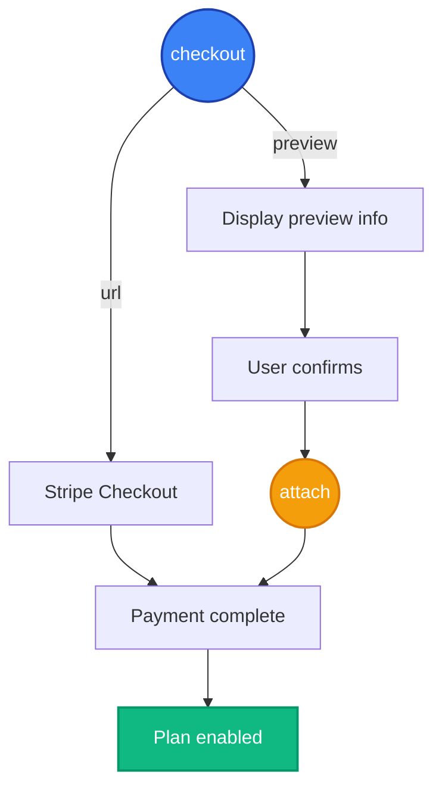

import CreatePlans from '/snippets/create-plans.mdx';


In this example we'll create the pricing for a premium AI chatbot. We're going to have:

- A <Badge color="green">Free</Badge> plan that gives users 5 chat messages per month for free
- A <Badge color="blue">Pro</Badge> plan that gives users 100 chat messages per month for $20 per month.

<Steps>
<Step>
### Create your pricing plans

Create a plan for each tier that your app offers. In our example we'll create a "Free" and "Pro" plan.

<CreatePlans />

</Step>

<Step>
### Installation

[Create an Autumn Secret key](https://app.useautumn.com/sandbox/dev?tab=api_keys), and paste it in your `.env` variables. Then, install the Autumn SDK.

```bash .env
AUTUMN_SECRET_KEY=am_sk_test_42424242...
```

<CodeGroup>

```bash bun
bun add autumn-js
```

```bash npm
npm install autumn-js
```

```bash pnpm
pnpm add autumn-js
```

```bash yarn
yarn add autumn-js
```

```bash pip
pip install autumn-py
```

</CodeGroup>

</Step>

<Step>
### Create an Autumn customer

When the customer signs up, create an Autumn customer for them. Autumn will automatically enable the <Badge color="green">Free</Badge> plan, since you marked it with the `auto-enable` flag.

<CodeGroup dropdown>

```typescript
import { Autumn } from "autumn-js";

const autumn = new Autumn({
	secretKey:'am_sk_42424242',
});

const { data, error } = await autumn.customers.create({
	id: "user_or_org_id_from_auth",
	name: "John Doe",
	email: "john@example.com",
});
```

```python
import asyncio
from autumn import Autumn

autumn = Autumn('am_sk_42424242')

async def main():
    customer = await autumn.customers.create(
        id="user_or_org_id_from_auth",
        name="John Doe",
        email="john@example.com",
    )

asyncio.run(main())
```

```bash
curl --request POST \
  --url https://api.useautumn.com/customers \
  --header 'Authorization: Bearer am_sk_42424242' \
  --header 'Content-Type: application/json' \
  --data '{
  "id": "user_or_org_id_from_auth",
  "name": "John Doe",
  "email": "john@example.com"
}'
```

</CodeGroup>

<Check>
Autumn's customer ID is the same as your internal user or org ID generated from your auth provider, so you can use the same ID for everything.
</Check>

In the Autumn dashboard, you will see your user under the [customers](https://app.useautumn.com/customers) page.

</Step>

<Step>
### Stripe Payment Flow


Handling payments and enabling plans is a 2-step process:
- `checkout` to get "checkout" information (either a Checkout URL, or purchase confirmation data)
- `attach` to enable the product for the customer and charge a saved payment method.

<Expandable title="payment flowchart">

</Expandable>


**Checkout**

Call the `checkout` function to get Stripe checkout page when the customer wants to purchase the <Badge color="blue">Pro</Badge> plan, and pass it to your frontend.

If their payment details are already on file, a Checkout URL will **not** be returned. Instead, checkout preview data (eg, prices) will be returned, which you can use to display to the user. 

This lets them confirm their upgrade, downgrade or new purchase.


<CodeGroup dropdown>

```typescript
import { Autumn } from "autumn-js";

const autumn = new Autumn({ 
  secretKey: 'am_sk_42424242' 
});

const { data } = await autumn.checkout({
  customer_id: "user_or_org_id_from_auth",
  product_id: "pro",
});

if (data.url) {
  // Return Stripe checkout URL to frontend
} else {
  // Return upgrade preview data to frontend
}
```

```python Python
import asyncio
from autumn import Autumn

autumn = Autumn('am_sk_42424242')

async def main():
  response = await autumn.checkout(
      customer_id='user_or_org_id_from_auth',
      product_id='pro'
  )

asyncio.run(main())
```

```bash cURL
curl -X POST 'https://api.useautumn.com/v1/checkout' \
-H 'Authorization: Bearer am_sk_42424242' \
-H 'Content-Type: application/json' \
-d '{
  "customer_id": "user_or_org_id_from_auth",
  "product_id": "pro"
}'
```

</CodeGroup>

<Note>
Use Stripe's test card `4242 4242 4242 4242` to make a purchase in sandbox. You can enter any Expiry and CVV.
</Note>


**Attach**

If the payment details are on file and the customer has confirmed their upgrade, use the `attach` function to charge their card and enable the plan.

This call is only needed if there was no URL returned from the `checkout` step.

<CodeGroup dropdown>

```typescript
import { Autumn } from "autumn-js";

const autumn = new Autumn({ 
  secretKey: 'am_sk_42424242' 
});

const { data } = await autumn.attach({
  customer_id: "user_or_org_id_from_auth",
  product_id: "pro",
});
```

```python
import asyncio
from autumn import Autumn

autumn = Autumn('am_sk_42424242')

async def main():
  response = await autumn.attach(
      customer_id='user_or_org_id_from_auth',
      product_id='pro'
  )

asyncio.run(main())
```

```bash
curl -X POST 'https://api.useautumn.com/v1/attach' \
-H 'Authorization: Bearer am_sk_42424242' \
-H 'Content-Type: application/json' \
-d '{
  "customer_id": "user_or_org_id_from_auth",
  "product_id": "pro"
}'
```

</CodeGroup>


This 2-step process can be used for any plan changes scenario (upgrades, downgrades, one-time topups, renewals, etc).

Upgrades will happen immediately, and downgrades will be scheduled for the next billing cycle.


</Step>
</Steps>

**Next: Track and limit usage**

Now that the plan is enabled and you've handled payments, you can now make sure that customers have the correct access and limits based on their plan.

<Card
  title="Track and limit usage"
  href='/documentation/getting-started/gating'
 >
Enforce usage limits and feature permissions using Autumn's `check` and `track` functions
 </Card>


