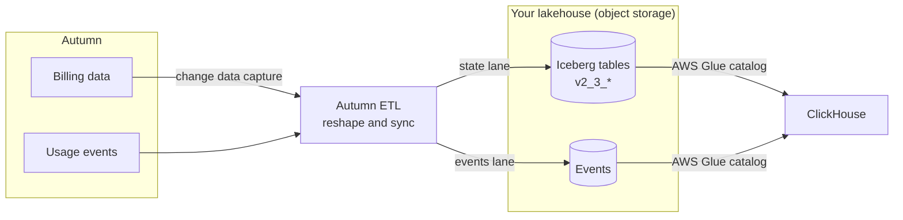

<Warning>
  **Available on request** — The Autumn Lakehouse is provisioned per customer. Contact us at [hey@useautumn.com](mailto:hey@useautumn.com) to get access.
</Warning>

The Autumn Lakehouse mirrors your entire Autumn dataset — customers, plans, subscriptions, invoices, balances, events, and more — into your own data warehouse as [Apache Iceberg](https://iceberg.apache.org/) tables. You read it directly with **ClickHouse**{/* or **BigQuery** — hidden until BigQuery delivery ships */}, no API pagination required.

It's built for analytics: BI dashboards, revenue and usage reporting, cohort analysis, and joining Autumn's billing data against your own product data — all in SQL, against the full history.

Every object is delivered as a table named `v2_3_<object>` (for example `v2_3_customers`, `v2_3_subscriptions`) inside a namespace Autumn assigns you. The usage event log is the one exception — it's immutable and unversioned, delivered as `events` (not `v2_3_events`).

## How it works

Autumn's pipeline continuously reshapes the live billing database into these analytics-friendly tables and syncs them to Iceberg in object storage. You attach your query engine to the catalog once — after that, data keeps flowing in and new columns appear automatically.

## Data freshness

<Tip>
  **State tables** (everything except events) sync under normal load within **~5 minutes** of a change in Autumn.
</Tip>

<Warning>
  **Events** have a variable lead time. On **initial connection**, historical events backfill and can take a while to fully populate — counts will climb until the backfill catches up, then track in near real-time.
</Warning>

## Schema versioning

The `v2_3` in every table name is the **schema version**. The Lakehouse schema changes far less often than Autumn's main API, and **all schema updates are applied automatically** — you never run a migration.

There are two kinds of change:

- **In-version (additive)** — a new column added to an existing `v2_3_*` table. Your existing saved queries keep working unchanged; the new column simply becomes available.
- **New version** — a future `v2_4_*`. This arrives as a **new table** and is **opt-in**. Your existing `v2_3_*` queries keep working untouched, and you adopt the new shape only when you choose to.

When we foresee a new version, we contact tenants beforehand. You **never need to reconnect** to receive updates — new columns and tables appear in your existing catalog automatically.

## Next steps

<CardGroup cols={3}>
  <Card title="Connecting" icon="plug" href="/documentation/lakehouse/connecting">
    Attach ClickHouse to your catalog.
  </Card>
  <Card title="Schema Reference" icon="table" href="/documentation/lakehouse/schema">
    Every table and column, with the keys to join on.
  </Card>
  <Card title="Querying" icon="magnifying-glass" href="/documentation/lakehouse/querying">
    Examples, cross-database joins, and footguns to avoid.
  </Card>
</CardGroup>
