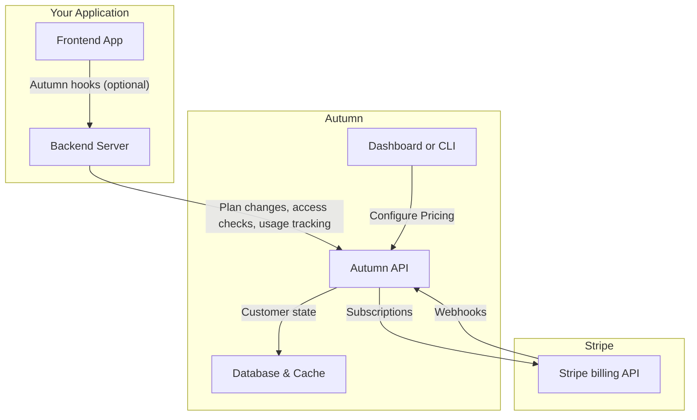

## What is Autumn?

Autumn is a pricing and billing layer between your application and Stripe. It acts as your source of truth for customer subscription statuses, usage metering and credit balances.

Instead of billing logic living in your code and database, your app can query Autumn in real-time to check if a customer is allowed to do something (eg, send an AI message, access SSO, etc).

## Why use Autumn?

AI made pricing and billing significantly harder for developers to build and maintain. For reference, OpenAI wrote a [blog post](https://openai.com/index/beyond-rate-limits/) about their in-house system. Here are some of the things you will need:

| Feature               | Requirements                                                                                          |
|-----------------------|--------------------------------------------------------------------------------------------------|
| Subscription logic    | Checkouts, prorated upgrades, scheduled downgrades, add-ons, trials. 10+ webhook cases to handle.  |
| Credit system         | Real-time enforcement, periodic vs one-time grants, rollovers, expiration, concurrency control |
| Controls and observability        | Auto top ups, spend caps, per-seat allowances, usage analytics, event logs  |
| Versioning and grandfathering     | Various price IDs, migration scripts, backwards compatibility                |
| Enterprise and custom plans   | Custom code, tiered pricing, custom credit grants, pilots, expansion logic    |
| Edge cases            | Plan switching, monthly/annual changes, failed payments, 3DS, race conditions, refunds   |

At some point you or your GTM team will want to change your pricing, and you will need to rebuild everything. 

Autumn replaces this, and offloads all this logic out of your codebase. After you set it up, everything about your pricing can be managed through our dashboard or config file. 

It's faster to setup, more flexible, more reliable and saves teams months of engineering time.

## How is this different?

Stripe has its own metered billing product, and there are others out there too like Metronome, Orb, Lago etc. All of these products allow you to record and bill for usage after an action is taken, making them good for end of month invoicing. 

However, prepaid credits and usage limits are becoming the default standard for AI monetization. This needs to work in real-time.

Put simply, Autumn's key differentiator is the `check` function: a low-latency API called designed to be called _before_ an action is taken, to gate access. This sounds trivial, but is a totally different product in 2 ways:

**Functionally**  
Because check runs before the action, Autumn becomes your system of record for pricing and entitlements.

With other providers, billing is asynchronous: you send usage, they generate invoices later, and _you own the logic and state in between_ — who gets access, when limits apply, how downgrades work etc.

Autumn owns that layer. Credit ledgers, real-time enforcement and spend caps work out of the box. Edge cases around upgrades, downgrades, and failed payments are handled automatically — users always get access to what they've paid for.

That also makes scaling challenges much simpler. Changing pricing, migrating plans, handling downgrades, setting up custom enterprise contracts with rollovers, or launching team billing with per-seat allowances become configuration changes instead of messy logic rewrites.

**Architecturally**  
`check` is designed to be called inline, before every AI generation, API request, or feature gate. We achieve response times of under 50ms via multi-region caching, with atomic handling of concurrent requests so credit balances and usage limits stay consistent even at scale.

Unlike other billing providers, Autumn is built on top of Stripe billing instead of replacing it. Your subscriptions, customers, and payment details live in your own Stripe account, so you're never "locked in".

<Check>
While Autumn's core focus is credit-based AI monetization, it can be used for any SaaS pricing model. Many of our users have no usage-based features at all, and just prefer the simplicity and developer experience (eg, no webhooks).
</Check>

## Core concepts

<Steps>
<Step title="Model your pricing in Autumn">
Model your pricing plans in the Autumn UI, or through a config file. Define your free, paid and any add-on pricing tiers.

You can link features to these plans and define their usage limits: both recurring (monthly, yearly), one-time top ups, rollovers, etc.
</Step>
<Step title="Handle payments">
The `attach` function will return a Stripe checkout URL, or confirmation data for an upgrade/downgrade for the plans you defined in step 1.

Once paid, the Autumn will grant access to the features on their plan.

</Step>

<Step title="Check permissions and limits">
When a customer tries to do something (eg, use a credit), [check](/documentation/customers/check) in real-time whether they're allowed to. 

If the user has access to the feature on their plan, and hasn't exceeded their usage limit, they will be allowed to do it.

</Step>

<Step title="Track usage">
If Autumn tells you they're `allowed` access, let them use the feature. Afterwards, you can [track the usage](/documentation/customers/tracking-usage) to update their balance, or bill them for any usage-pricing.

</Step>
</Steps>

Autumn also provides APIs to easily get customer billing data (to display on a billing page), open Stripe billing portal, display usage analytics, handle org billing, setup referral programs and more.

<Card
  title="Join us on Discord"
  icon="discord"
  href="https://discord.gg/STqxY92zuS"
>
  Connect with us, other users, and get integration support within minutes --
  we're always online (if we're awake)
</Card>
