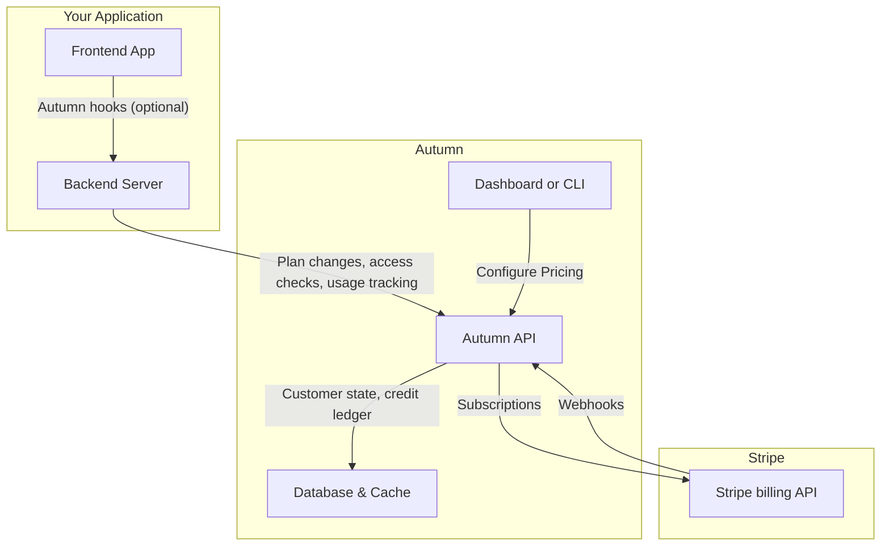

hello world

## What is Autumn?

Autumn is a pricing and billing layer between your application and Stripe. It owns the subscription lifecycle, credit ledgers, and entitlement state that you'd otherwise build and maintain yourself.

Instead of billing logic living in your code and database, your app can query Autumn in real-time to check if a customer is allowed to do something (eg, send an AI message, access SSO, etc).

This saves you months of engineering time, and makes pricing changes a simple configuration change.

## Why use Autumn?

For reference, here's what a production-grade monetization system looks like in the AI era. OpenAI wrote a [blog post](https://openai.com/index/beyond-rate-limits/) about their in-house system.

| Feature               | Requirements                                                                                          |
|-----------------------|--------------------------------------------------------------------------------------------------|
| Subscription logic    | Checkouts, prorated upgrades, scheduled downgrades, add-ons, trials. 10+ webhook cases.  |
| Credit ledgers        | Real-time enforcement, periodic vs one-time grants, rollovers, expiration, concurrency control |
| Controls and observability        | Auto top ups, spend caps, per-seat allowances, usage analytics, event logs  |
| Versioning and grandfathering     | Various price IDs, migration scripts, backwards compatibility                |
| Enterprise and custom plans   | Custom code, tiered pricing, custom credit grants, pilots, expansion logic    |
| Edge cases            | Plan switching, monthly/annual changes, failed payments, 3DS, race conditions, refunds   |

Billing starts with a simple checkout flow, and balloons in complexity as you add more features and scale. And when you want to change your pricing, you need to rebuild everything. Yet, it's a critical part of your product that you cannot afford to get wrong.

You can choose to build this yourself, or use Autumn to offload all this logic out of your codebase. It's less work, more flexible, and more reliable.

## How is this different?

Most billing tools, including Stripe's built-in metering, are designed for post-hoc invoicing: you send usage events, they generate invoices at end of period. Your app still owns who gets access, when limits apply, how downgrades work (and all the other logic described above).

Autumn flips this. The `check` function is a low-latency API designed to be called _before_ an action is taken, to gate access based on the customer's plan and balance. Because it runs before the action, Autumn becomes your system of record for subscriptions and entitlements — not your database or Stripe.

This means credit ledgers, real-time enforcement, spend caps, and edge cases around upgrades, downgrades and failed payments are handled automatically. Changing pricing, migrating plans, or setting up custom enterprise contracts become configuration changes instead of code changes.

Architecture-wise, `check` is designed to be called inline — before every AI generation, API request, or feature gate. Response times are under 50ms via multi-region caching, with atomic handling of concurrent requests so balances stay consistent at scale.

Autumn is built on top of Stripe rather than replacing it. Your subscriptions, customers, and payment details live in your own Stripe account.

<Check>
While Autumn's core focus is credit-based AI monetization, it handles any SaaS pricing model. Many of our users have no usage-based features at all, and just prefer the developer experience (eg, no webhooks).
</Check>

## Core flow

<Steps>
<Step title="Model your pricing in Autumn">
Model your pricing plans in the Autumn UI, or through a config file. Define your free, paid and any add-on pricing tiers.

You can link features to these plans and define their usage limits: both recurring (monthly, yearly), one-time top ups, rollovers, etc.
</Step>
<Step title="Handle payments">
The `attach` function will return a Stripe checkout URL, or confirmation data for an upgrade/downgrade for the plans you defined in step 1.

Once paid, the Autumn will grant access to the features on their plan.

</Step>

<Step title="Check permissions and limits">
When a customer tries to do something (eg, use a credit), [check](/documentation/customers/check) in real-time whether they're allowed to. 

If the user has access to the feature on their plan, and hasn't exceeded their usage limit, they will be allowed to do it.

</Step>

<Step title="Track usage">
If Autumn tells you they're `allowed` access, let them use the feature. Afterwards, you can [track the usage](/documentation/customers/tracking-usage) to update their balance, or bill them for any usage-pricing.

</Step>
</Steps>

Autumn also provides APIs to easily get customer billing data (to display on a billing page), open Stripe billing portal, display usage analytics, handle org billing, setup referral programs and more.

<Card
  title="Join us on Discord"
  icon="discord"
  href="https://discord.gg/STqxY92zuS"
>
  Connect with us, other users, and get integration support within minutes --
  we're always online (if we're awake)
</Card>
